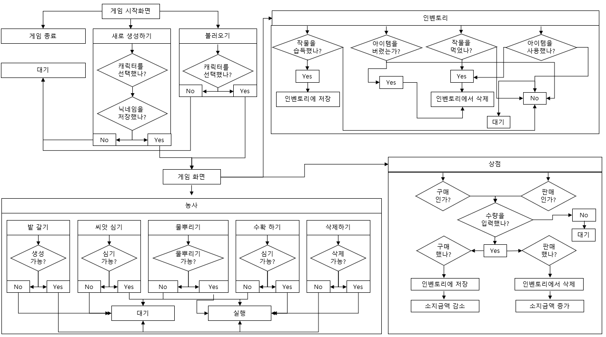
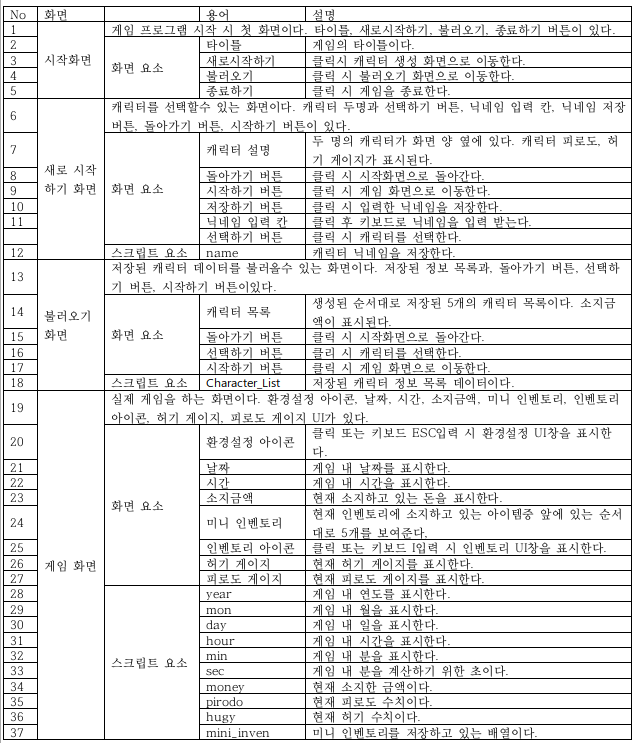

# 프로젝트명: 판타지 팜  
### 제작자: 엄지승  
### 1. [컨셉](#보물)  
### 2. [관련 이미지와 동영상](#2)  
### 3. [대표 이미지](#3)  
### 4. [컨셉 and 대표이미지 기반 작품묘사](#4)
### 5. [판타지 팜의 구성 요소](#5)  
### 6. [게임시스템디자인](#6)  
a. 게임 오브젝트 분해(#7)    
b. 파라미터(속성)(#8)  
c. 행동(#9)  
d. 상태(#10)   
e. 플레이어 캐릭터 속성(파라미터)(#11)   
f. 게임의 규칙(#12)   
g. 게임에서 사용될 공식(#13) 
### 7. [개발 요구사항 & 흐름도](#14)  
a. 요구사항(#15)  
b. 시간별 흐름도 flowchart(#16)  
c. 키보드 이벤트에 대한 흐름로(#17)  
d. 용어정리(#18)  
### 8. [스토리보드](#19)  
### 9. [프로토타입 개발 요구사항](#20)  
  
# [컨셉]   
## 1. 메인컨셉  
생활: 플레이어가 농사를 짓고 음식을 만들며 마을 주민들과 소통하면서 필요한 물품들을 사고 팔며 자극적이지 않고 또 다른 생활을 느끼게 하고 싶으므로 생활이라는 컨셉을 하였습니다.  
### 서브 컨셉 1: 마법  
평범한 낫, 도끼 등으로 농사를 짓는 것보다는 마법이라는 컨셉을 사용하여 플레이어가 직접 움직이지 않고 마우스를 움직여 거리가 떨어진 곳에서도 밭을 생성하거나 물을 주는 등 행동이 가능하게 된다면 지루함을 덜 수 있다고 생각합니다.  
### 서브 컨셉 2: 소리  
직접적으로 플레이어가 움직이는 것이 아닌 가만히 서서 특정 행동을 할 수 있기 때문에 행동에 따른 소리를 전달함으로써 현실감을 줄 수 있다고 생각합니다.  
### 서브 컨셉 3: 동물  
동물들을 마을 주민에게서 구매하여 귀여운 동물들을 집 근처에 둘 수 있고 쓰다듬기 등 상호작용을 함으로써 더 재미를 느낄 것으로 생각합니다.  
### 서브 컨셉 4: 제작  
농사를 지은 아이템 또는 상점에서 구매한 아이템을 활용하여 아이템을 제작함으로써 플레이어의 수집욕을 자극할 수 있다고 생각합니다.  
### 서브 컨셉 5: 소통  
플레이어가 농사만 하는 것이 아닌 마을 주민들과 대화와 선물 등을 통해 호감도를 쌓아서 특정 아이템을 할인 가격으로 살 수 있게 하거나, 호감도가 오를수록 점점 말을 친절하게 하는 등 게임 npc가 아닌 친구의 느낌을 줄 수 있다고 생각합니다.  
  

# [관련 이미지 & 동영상]   
### - 관련 이미지
  
  
  
    

# [대표 이미지]   
  
    

# [컨셉 & 대표이미지 기반 작품 묘사]   
### 대표이미지 기반 :   
### 컨셉 기반:   
   
# [<판타지 팜> 구성 요소]   
묘사: 농지를 넓혀 밭을 개간하고 씨앗을 심으며 키우는 힐링게임  
   

## 1. 메커니즘  
[도전 과제]  
1. 돈을 모아 다양한 씨앗을 구매하여 키운다.
2. npc들에게 선물을 하거나 대화를하여 호감도를 높인다.
[재미 요소]
1. 다양한 씨앗을 구매하여 심어보고 각양각색의 농작물을 볼 수 있다.
2. 키운 농작물들을 사용하여 다양한 음식을 제작할 수 있다.
3. 플레이어 피로도, 허기 게이지를 만들어 이를 플레이어가 관리하게 하여 지루함을 줄인다.
 

## 2. 이야기  
[만들게 된 배경]  
평소에 농장 게임을 즐겨했고 만들어야 한다면 잘 모르는 RPG나 슈팅 같은 액션 게임보다 잘 알고 좋아하는 게임을 만드는게 만드는 과정도 즐거울 것 같고 제작에 필요한 요소들도 어느 정도 알고 있어서 게임을 만드는데 용이할것 같아서 농장 게임을 만들게 되었습니다.  
[카메라 관점]  
기본적으로 플레이어 후방 위에 있어서 캐릭터 뒷모습과 그 주위의 맵을 볼 수 있으며, 마우스를 왼쪽, 오른쪽, 위, 아래로 움직임으로써 카메라 회전이 가능하고 스크롤바를 사용해서 줌인 줌 아웃이 가능합니다.  
   

## 3. 미적 요소  
[디자인]  
맵:  
1. 플레이어 집은 시골을 배경으로하고 주변에 나무, 잡초등을 심어놓는다.(플레이어가 제가하면서 밭을 넓혀가는 형식)
2. 마을또한 시골을 배경으로해서 돌담으로 구역을 지정하고 각 구역마다 담당 npc를 배정한다.
3. 숲은 산을 배경으로 플레이어가 걸어 다닐수 있는 길은 흙길로 만들고 그 근처에 나무와 돌을 배치한다.
캐릭터 디자인: 교복 또는 멜빵등 귀엽고 수수한 복장의 캐릭터를 사용한다.
아이템 디자인: 씨앗, 동물, 농작물을 실제를 모티브로화되 귀여운 그림을 사용한다.
메인 UI: 플레이어가 중앙에 있고 오른쪽 상단에 현재 시간, 날짜, 소지금액이 표시되고 오른쪽 하단에 플레이어의 피로도, 허기 게이지를 배치합니다. 또한 왼쪽 상단에 옵션 아이콘이 있고 중앙 하단에 현재 소지한 아이템중 5가지를 보여줍니다.

[컬러]
기본적으로 갈색, 주황, 초록 계열을 사용해서 맵과 상점, 인벤토리등 UI를 제작하여 따뜻한 감성을 제공하려합니다.

[음향]
배경은 잔잔하지만 밝은 음악을 사용합니다.
밭을 생성할때는 팍하고 땅을 찍는 소리를 사용, 물을 뿌릴때는 비소리, 수확할때는 바람소리를 사용할 예정입니다.

## 4. 기술  
유니티 엔진을 사용하여 PC용으로 개발할 예정이며, 기본적인 플레이는 키보드와 마우스로 플레이 할 수 있게끔할 것입니다.  
또한 저사양 PC로도 플레이 할 수 있도록 개발할 예정입니다.  

## 5. 게임시스템디자인   
# 1. 게임 오브젝트 분해 (구성 요소 분석)  

|연번|종류|OBJ 이름|OBJ 영문명|사용처|오브젝트 이미지|  
|:----:|:----:|:----:|:----:|:----:|:----:|  
|1|아이템|토마토 씨앗|Tomato Seed|플레이어 집||  
|2|아이템|옥수수 씨앗|Corn Seed|플레이어 집||  
|3|아이템|호박 씨앗|Pumpkin Seed|플레이어 집||  
|4|아이템|순무 씨앗|Turnip Seed|플레이어 집||  
|5|아이템|당근 씨앗|Carrot Seed|플레이어 집||  
|6|풀|잡초|Weed|플레이어 집||  
|7|나무|나무|Tree|플레이어 집||  
|8|돌|돌|Rock|플레이어 집||  
|9|동물|닭|Chicken|플레이어 집||  
|10|농사|밭|Field|플레이어 집||  
|11|아이템|토마토|Tomato|공통||  
|12|아이템|옥수수|Corn|공통||  
|13|아이템|호박|Pumpkin|공통||  
|14|아이템|순무|turnip|공통||  
|15|아이템|당근|Carro|공통||  
|16|아이템|사과|Apple|숲||  
|17|나무|사과 나무|Apple Tree|숲||  
|18|Npc|미나|Mina|마을||  
|19|Npc|카타리나|Katarina|마을||  
|20|Npc|샨|Shan|마을||  
|21|UI|인벤토리|Inventory|||  
|22|UI|허기 게이지|Hunger Gauge|||  
|23|UI|피로도 게이지|Pirodo Gauge|||  
|24|UI|씨앗 상점|Seed Shop|||  
|25|UI|음식점|Food Shop|||  
|26|UI|목축점|Ranch Shop|||  
|27|UI|제작창|Crafting Tab|||  
|28|UI|환경설정 아이콘|Settings Icon|||  
|29|UI|환경설정|Settings Tab|||  
|30|UI|미니 인벤토리|Mini Inventory|||  
|31|UI|소지금액|Amount Tap|||  
|32|UI|날짜|Data Tab|||   
|33|UI|시간|Time Tab|||  
|34|UI|구매, 판매 버튼|Sell, Buy Button|||  
|35|UI|토마토 씨앗|Tomato Seed|||  
|36|UI|옥수수 씨앗|Corn Seed|||  
|37|UI|호박씨앗 |Pumpkin Seed|||  
|38|UI|순무 씨앗|Turnip Seed|||  
|39|UI|당근 씨앗|Carrot Seed|||  
|40|UI|토마토|Tomato_UI|||  
|41|UI|옥수수|Corn_UI|||  
|42|UI|호박|Pumpkin_UI|||  
|43|UI|순무|Turnip_UI|||  
|44|UI|당근|Carrot_UI|||  
|45|UI|계란|Egg|||  
|46|UI|토마콘스프|TomaCornSoup|||  
|47|UI|호박 샐러드|Pumpkin Salad|||  
|48|UI|계란후라이|Fried Egg|||  
|49|UI|건강 주스|Health Juice|||  
|50|UI|사과 주스|Apple Juice|||  
|51|UI|사과|Apple|||  
|52|UI|쓰레기 통|Trash Can|||  
|53|플레이어|플레이어|Player|||  
|54|장비|오브|Ob|||  

### 2. 파라미터(속성) 뽑아 보기    

1) 오브젝트 이름 : 토마토 씨앗  

|속성|영문명칭|설명|비고|  
|:----:|:----:|:----:|:----:|  
|판매 금액|Sell|상점에 판매하는 가격||  
|구매 금액|Buy|상점에서 구매하는 가격||  
|작물|Crops|씨앗을 심고 난 후 자란 오브젝트||  

2) 오브젝트 이름 : 옥수수 씨앗  

|속성|영문명칭|설명|비고|  
|:----:|:----:|:----:|:----:|  
|판매 금액|Sell|상점에 판매하는 가격||  
|구매 금액|Buy|상점에서 구매하는 가격||  
|작물|Crops|씨앗을 심고 난 후 자란 오브젝트||  

3) 오브젝트 이름 : 호박 씨앗  

|속성|영문명칭|설명|비고|  
|:----:|:----:|:----:|:----:|  
|판매 금액|Sell|상점에 판매하는 가격||  
|구매 금액|Buy|상점에서 구매하는 가격||  
|작물|Crops|씨앗을 심고 난 후 자란 오브젝트|| 

4) 오브젝트 이름 : 순무 씨앗  

|속성|영문명칭|설명|비고|  
|:----:|:----:|:----:|:----:|  
|판매 금액|Sell|상점에 판매하는 가격||  
|구매 금액|Buy|상점에서 구매하는 가격||  
|작물|Crops|씨앗을 심고 난 후 자란 오브젝트||  

5) 오브젝트 이름 : 당근 씨앗  
  
|속성|영문명칭|설명|비고|  
|:----:|:----:|:----:|:----:|  
|판매 금액|Sell|상점에 판매하는 가격||  
|구매 금액|Buy|상점에서 구매하는 가격||  
|작물|Crops|씨앗을 심고 난 후 자란 오브젝트||  

6) 오브젝트 이름 : 닭  

|속성|영문명칭|설명|비고|  
|:----:|:----:|:----:|:----:|  
|판매 금액|Sell|상점에 판매하는 가격||  
|구매 금액|Buy|상점에서 구매하는 가격||  
|쿨타임|Egg_Time|계란을 생성하는데 소요되는 시간||  

7) 오브젝트 이름 : 토마토  

|속성|영문명칭|설명|비고|  
|:----:|:----:|:----:|:----:|  
|판매 금액|Sell|상점에 판매하는 가격||  
|구매 금액|Buy|상점에서 구매하는 가격||  
|회복|Pirodo_Cure|섭취시 플레이어 피로도 회복||  
|회복|Full|섭취시 플레이어 허기를 채워줌||  
|선물|gift|npc에게 선물을 했을때 오르는 호감도의 정도||  

8) 오브젝트 이름 : 옥수수  

|속성|영문명칭|설명|비고|  
|:----:|:----:|:----:|:----:|  
|판매 금액|Sell|상점에 판매하는 가격||  
|구매 금액|Buy|상점에서 구매하는 가격||  
|회복|Full|섭취시 플레이어 허기를 채워줌||  
|선물|gift|npc에게 선물을 했을때 오르는 호감도의 정도||  

9) 오브젝트 이름 : 호박  

|속성|영문명칭|설명|비고|  
|:----:|:----:|:----:|:----:|  
|판매 금액|Sell|상점에 판매하는 가격||  
|구매 금액|Buy|상점에서 구매하는 가격||  
|회복|Pirodo_Cure|섭취시 플레이어 피로도 회복||  
|회복|Full|섭취시 플레이어 허기를 채워줌||  
|선물|gift|npc에게 선물을 했을때 오르는 호감도의 정도||  

10) 오브젝트 이름 : 순무  

|속성|영문명칭|설명|비고|  
|:----:|:----:|:----:|:----:|  
|판매 금액|Sell|상점에 판매하는 가격||  
|구매 금액|Buy|상점에서 구매하는 가격||  
|회복|Full|섭취시 플레이어 허기를 채워줌||  
|선물|gift|npc에게 선물을 했을때 오르는 호감도의 정도||  

11) 오브젝트 이름 : 당근  

|속성|영문명칭|설명|비고|  
|:----:|:----:|:----:|:----:|  
|판매 금액|Sell|상점에 판매하는 가격||  
|구매 금액|Buy|상점에서 구매하는 가격||  
|회복|Pirodo_Cure|섭취시 플레이어 피로도 회복||  
|회복|Full|섭취시 플레이어 허기를 채워줌||  
|선물|gift|npc에게 선물을 했을때 오르는 호감도의 정도||  

12) 오브젝트 이름 : 계란  

|속성|영문명칭|설명|비고|  
|:----:|:----:|:----:|:----:|  
|판매 금액|Sell|상점에 판매하는 가격||  
|구매 금액|Buy|상점에서 구매하는 가격||  
|선물|gift|npc에게 선물을 했을때 오르는 호감도의 정도||  

13) 오브젝트 이름 : 토마콘스프  

|속성|영문명칭|설명|비고|  
|:----:|:----:|:----:|:----:|  
|판매 금액|Sell|상점에 판매하는 가격||  
|구매 금액|Buy|상점에서 구매하는 가격||  
|회복|Pirodo_Cure|섭취시 플레이어 피로도 회복||  
|회복|Full|섭취시 플레이어 허기를 채워줌||  
|선물|gift|npc에게 선물을 했을때 오르는 호감도의 정도||  

14) 오브젝트 이름 : 호박 샐러드  

|속성|영문명칭|설명|비고|  
|:----:|:----:|:----:|:----:|  
|판매 금액|Sell|상점에 판매하는 가격||  
|구매 금액|Buy|상점에서 구매하는 가격||  
|회복|Pirodo_Cure|섭취시 플레이어 피로도 회복||  
|회복|Full|섭취시 플레이어 허기를 채워줌||  
|선물|gift|npc에게 선물을 했을때 오르는 호감도의 정도||  

15) 오브젝트 이름 : 계란 후라이  

|속성|영문명칭|설명|비고|  
|:----:|:----:|:----:|:----:|  
|판매 금액|Sell|상점에 판매하는 가격||  
|구매 금액|Buy|상점에서 구매하는 가격||  
|회복|Pirodo_Cure|섭취시 플레이어 피로도 회복||  
|회복|Full|섭취시 플레이어 허기를 채워줌||  
|선물|gift|npc에게 선물을 했을때 오르는 호감도의 정도||  

16) 오브젝트 이름 : 건강주스스  

|속성|영문명칭|설명|비고|  
|:----:|:----:|:----:|:----:|  
|판매 금액|Sell|상점에 판매하는 가격||  
|구매 금액|Buy|상점에서 구매하는 가격||  
|회복|Pirodo_Cure|섭취시 플레이어 피로도 회복||  
|회복|Full|섭취시 플레이어 허기를 채워줌||  
|선물|gift|npc에게 선물을 했을때 오르는 호감도의 정도||  

17) 오브젝트 이름 : 사과 주스  

|속성|영문명칭|설명|비고|  
|:----:|:----:|:----:|:----:|  
|판매 금액|Sell|상점에 판매하는 가격||  
|구매 금액|Buy|상점에서 구매하는 가격||  
|회복|Pirodo_Cure|섭취시 플레이어 피로도 회복||  
|회복|Full|섭취시 플레이어 허기를 채워줌||  
|선물|gift|npc에게 선물을 했을때 오르는 호감도의 정도||  

18) 오브젝트 이름 : 사과  

|속성|영문명칭|설명|비고|  
|:----:|:----:|:----:|:----:|  
|판매 금액|Sell|상점에 판매하는 가격||  
|회복|Pirodo_Cure|섭취시 플레이어 피로도 회복||  
|회복|Full|섭취시 플레이어 허기를 채워줌||  
|선물|gift|npc에게 선물을 했을때 오르는 호감도의 정도||  

19) 오브젝트 이름 : 미나  

|속성|영문명칭|설명|비고|  
|:----:|:----:|:----:|:----:|  
|호감도|Likability|플레이어게 나타나는 호감도||  
|선물 확인|Check_Gift|호감도를 대폭 높여주는 특정 아이템의 종류||  

20) 오브젝트 이름 : 카타리나  

|속성|영문명칭|설명|비고|  
|:----:|:----:|:----:|:----:|  
|호감도|Likability|플레이어게 나타나는 호감도||  
|선물 확인|Check_Gift|호감도를 대폭 높여주는 특정 아이템의 종류||  

21) 오브젝트 이름 : 샨  

|속성|영문명칭|설명|비고|  
|:----:|:----:|:----:|:----:|  
|호감도|Likability|플레이어게 나타나는 호감도||  
|선물 확인|Check_Gift|호감도를 대폭 높여주는 특정 아이템의 종류||  

### 3. 행동 뽑아 보기  
1) 오브젝트 이름 : 플레이어(Player)

|행동|영문명칭|설명|
|:----:|:----:|:----:|
|앞으로 이동|Forward|방향키 위키를 누르면 앞으로 이동|  
|뒤로 이동|Back|방향키 아래키를 누르면 뒤로 이동|  
|오른쪽으로 이동|Right|방향키 오른쪽키를 누르면 오른쪽으로 이동|  
|왼쪽으로 이동|Left|방향키 왼쪽키를 누르면 왼쪽으로 이동|  
|밭 생성하기|Create Field|오브를 우클릭후 밭 생성 클릭 / 오브에서 갈색 파티클이 나오면 밭 생성|  
|씨앗 심기|Planting Seed|오브를 우클릭후 씨앗 심기 클릭 / 오브에서 초록색 파티클이 나오며 밭에 씨앗 심음|  
|물 뿌리기|Watering|오브를 우클릭후 물 뿌리기 클릭 / 오브에서 작은 구름이 생성되고 밭으로 이동 후 비가 내림|  
|수확하기|Havesting|오브를 우클릭후 수확하기 클릭 / 오브에서 하늘색 파티클이 나온 후 밭으로 이동 후 작물을 제거|  
|삭제하기|Delete|오브를 우클릭후 삭제하기 클릭 / 오브에서 검은색 파티클이 나오며 선택한 오브젝트 삭제|  
|수면|Sleep|침대에서 F키를 누르면 플레이어가 침대 위로 이동 후 잠을 자는 행동을 취함|  
|먹음|Eat|플레이어가 인벤토리에서 음식을 섭취하면 음식의 종류에따라 피로도, 허기짐을 채움|  

### 4. 상태 뽑아 보기   

1) 오브젝트 이름 :  플레이어(Player)  

|현상태|전이상태|전이조건|  
|:----:|:----:|:----:|  
|정상|피곤함|피로도게이지가 일정 수준 아래로 떨어지면 이동속도 저하|  
|정상|배고픔|허기짐게이지가 일정 수준 이하로 떨어지면 이동속도와 작업속도 저하|  
|정상|쓰러짐|피로도 또는 허기 게이지가 0일때 밭 생성, 씨앗 심기, 물 뿌리기, 수확하기를 하거나 시간이 밤 12시가 넘었을때 수면을 하지 않았다면 플레이어가 쓰러짐|  

### 5. 플레이어 캐릭터 속성(파라미터)  

|속성|영문명칭|설명|비고|  
|:----:|:----:|:----:|:----:|  
|게이지|Pirodo|플레이어 피로도 수치||  
|게이지|Hungerr|플레이어 허기 수치||  
|스피트|Speed|플레이어 이동 속도||  
|쿨타임|CreateF_Time|밭을 생성하는데 소요되는 시간||  
|쿨타임|PlantS_Time|씨앗을 심는데 소요되는 시간||  
|쿨타임|Watering_Time|물을 뿌리는데 소요되는 시간||  
|쿨타임|Havesting_Time|수확하는데 소요되는 시간||  
|행동범위|Skill_Range|밭, 씨앗, 물, 수확이 가능한 범위||  
|소지금액|Money|플레이어가 소지하고 있는 금액||  

### 6. 게임의 규칙  
1) 핵심 규칙  
1. 플레이어는 밭을 생성하기 위해서는 집 주위의 나무, 돌, 잡초등을 제거해야한다.  
2. 플레이어가 밭에 씨앗을 심기위해서는 상점에서 씨앗을 구매하여야한다.  
3. 플레이어는 밤 12시 이전에 집에서 수면을 취해야한다 그렇지 않으면 쓰러지게 된다.  
4. 플레이어는 피로도와 허기짐을 관리하여야한다. 그렇지 않으면 쓰러지게 된다.  

2) 보조 규칙  
1. 플레이어는 npc에게 선물을 주는 것으로 호감도를 높일수 있으며 호감도가 높아지면 npc가 선묾을 주는 이벤트가 발생될 수 있다.  
2. 제작한 음식(아이템)을 판매하여 더 큰 돈을 벌 수 있다.  

### 7. 게임에서 사용될 공식   
1. 허기게이지가 0일때 플레이어는 쓰러진다.  
2. 허기게이지가 특정 기준 아래로 내려가면 이동 속도가 느려진다.  
3. 피로도게이지가 특정 기준 아래로 내려가면 이동 속도와 행동 속도가 느려진다.  
4. 플레이어는 밤 12시 이전에 취침을 해야한다.  
5. 씨앗은 구매와 npc의 선물을 통해서만 얻을 수 있고 동물은 구매를 통해서만 얻을 수 있다.  
6. 플레이어가 npc에게 선물을 주면 호감도가 올라간다.  
7. 제작한 음식(아이템)과 씨앗, 열매는 판매가 가능하다.  
8. 밭갈기, 씨앗 심기, 물뿌리기, 수확하기 행동에는 쿨타임이 존재하며 쿨타임인 동안은 다른 행동은 취할 수 없다.
 
### 8. 개발 요구사항 & 흐름도    
## 요구사항 
1-1  시작화면, 게임화면, 캐릭터 생성 화면, 불러오기 화면 총 4개의 화면이 있다.  
1-2  시작화면에는 새로시작하기, 불러오기, 종료하기 버튼 3개가 있다.  
1-3  새로 시작하기 버튼을 클릭 시 캐릭터 생성 화면으로 이동한다.  
1-4 불러오기 버튼을 클릭 시 불러오기 화면으로 이동한다.  
1-5 종료하기 버튼을 클릭 시 게임이 종료된다.  
1-6 캐릭터 생성 화면에서는 화면 중앙을 기준으로 양 옆에 캐릭터 두명을 보여주며 화면 중앙 하단에 닉네임을 입력하는 입력칸이 표시되며, 닉네임 저장 버튼과 생성하기 버튼이 있으며 누르면 게임화면으로 변경된다.  
1-7 불러오기 화면에서는 화면 중앙에 저장되어있는 캐릭터 정보들을 표시해주며 시작하기 버튼이 있으며 누르면 게임화면으로 변경된다.  

  
2-1 게임화면에는 왼쪽 상단에는 환경설정 아이콘, 오른쪽 상단에는 게임 내 날짜, 시간, 소지금액, 중앙 하단에는 미리보기 인벤토리 5칸, 오른쪽 하단에는 가방 아이콘, 에너지 게이지, 허기 게이지 UI가 표시된다.  
2-2 게임화면의 중간에는 플레이어가 비춰지고, 기본적으로 화면은 플레이어 후방 위쪽에 존재한다.  
2-3 게임화면에서 마우스로 클릭 후 상, 하, 좌, 우로 이동시 카메라가 그 방향에 따라 회전한다.  
2-4 맵은 플레이어 집, 숲, 마을 총 3개가 있다.  
2-5 플레이어 집에는 상호작용 가능한 오브젝트로 침대, 솥이 있다.  
2-6 침대에서 F키를 눌러 상호 작용시 수면 애니메이션을 실행한다.  
2-7 솥에서 F키를 눌러 상호 작용시 제작 탭이 표시된다.  
2-8 제작 탭에는 화면 오른쪽에는 레시피, 왼쪽에는 제작중인 아이템 정보, 중앙 상단에는 현재 선택한 레시피 정보, 왼쪽 하단에는 제작에 필요한 아이템UI를 표시하며 그 옆에는 제작하기 버튼이있다.  
2-9 제작하기 버튼을 클릭 시 화면 중앙에 제작할 아이템 개수를 입력 받는 창이 나오며 칸 아래에 제작하기 버튼이 표시된다.  
2-10 수량 입력 후 제작하기 버튼을 클릭 시 창이 사라지며 제작 탭 왼쪽 제작중인 아이템 정보에 제작한 아이템 정보 표시한다.  
2-11 제작이 완료되면 게임 화면 왼쪽 상단에 완료된 아이템을 표시해준다.  
2-12 마을에는 npc 3명이 있으며 음식점, 씨앗 상점, 목축장이 있다.  
2-13 각 npc앞에서 F키를 눌러 상호작용 시 대화창 UI가 표시된다.  
2-14 대화창 UI에는 상점이용하기, 대화하기, 선물하기 버튼 3개와 npc가 플레이어에게 하는 말이 표시된다.  
2-15 상점 이용하기 버튼 클릭 시 상점 UI에는 화면 중앙을 기준으로 왼쪽에는 상점에서 판매하는 아이템과 구매 버튼, 오른쪽에는 플레이어의 인벤토리와 판매버튼이 표시된다.  
2-16 구매 버튼 또는 판매 버튼을 누르면 구매할 개수를 입력하는 창이 표시된다.  
2-17 창에서 개수를 입력하고 구매하기 버튼을 누르면 소지금액이 감소하고 인벤토리에 구매한 아이템이 들어간다.  
2-18 창에서 개수를 입력하고 판매하기 버튼을 누르면 소지금액이 증가하고 인벤토리에 판매한 아이템이 삭제된다.  
2-19 대화하기 버튼 클릭 시 npc의 호감도에 따라 플레이어게 말하는 UI가 표시된다.  
2-20 선물하기 버튼 클릭 시 npc에게 선물할 수 있는 아이템과 선물하기 버튼이 표시된다.  
2-21 선물하기 버튼 클릭 시 선물한 아이템에 따라 호감도가 올라간다.  
2-22 마우스 휠을 위로 올리면 화면이 줌 인이된다.  
2-23 마우스 휠을 아래로 내리면 화면이 줌 아웃 된다.  

    
3-1 키보드 상, 하, 좌, 우로 이동이 가능하다.  
3-2  Shift키를 누르면 달리기를 실행한다.  
3-3 기본적으로 캐릭터 오른쪽에 구체가 떠다니며 캐릭터가 이동, 회전하면 같이 이동한다.  
3-4 기본적으로 캐릭터가 이동하는 방향은 카메라가 바라보는 방향이며 캐릭터가 이동 중 카메라가 회전하면 캐릭터가 바라보는 방향도 카메라가 바라보는 방향으로 바뀐다.  
3-5 구체를 클릭 시 구체를 중심으로 밭갈기, 씨앗 심기, 물 뿌리기, 수확하기, 삭제하기 총 5개 버튼 UI가 표시된다.  
3-6 밭 갈기 클릭 시 구체의 색깔이 갈색으로 변하며 마우스를 따라다니는 밭 오브젝트가 표시된다.  
3-7 이 밭 오브젝트는 밭이 생성 가능할 때 노란색, 불가능할때는 붉은색으로 변한다.  
3-8 생성 가능한 곳에 클릭 시 그 곳에 밭이 생성된다.  
3-9 씨앗 심기 버튼을 클릭 시 구체의 색깔이 초록색으로 변한다.  
3-10 아무것도 없는 밭을 클릭 시 클릭한 밭에 씨앗을 심는다.  
3-11 물 뿌리기 버튼을 클릭 시 구체의 색깔이 파란색으로변하며 씨앗이 심겨져 있는 밭을 클릭 시 물을 뿌리며 밭 색깔을 진한 갈색으로 바꾼다.  
3-12 수확하기 버튼을 클릭 시 구체의 색깔이 주황색으로 변하며 다 자란 작물을 클릭 시 작물의 종류에 따라 수확한다.  
3-13 수확 후 다시 자라나는 작물이라면 작물을 삭제하지 않고 작물 크기가 줄어들며 작물 중심으로 열매가 작물 주변으로 떨어진다.  
3-14 수확 후 사라지는 작물이라면 클릭 시 작물을 삭제하고 주변에 열매가 떨어진다.  
3-15 삭제하기 버튼을 클릭 시 구체가 검은색으로 바뀌며 밭, 작물을 클릭 시 삭제한다.  
3-16 허기는 게임 내 시간이 흐르면 지속적으로 감소한다.  
3-17 피로도는 게임 내 스킬을 사용했을때 감소한다.  
3-18 피로도, 허기 게이지가 0일때 캐릭터는 쓰러짐 상태로 바뀐다.  
3-19 피로도 게이지가 20아래로 떨어지면 피곤함 상태로 바뀐다.  
3-20 허기짐 게이지가 20아래로 떨어지면 배고픔 상태로 바뀐다.  

    
4-1 인벤토리 아이콘 클릭 또는 키보드 I키를 누를 시 화면 중앙에 인벤토리 UI를 표시한다.  
4-2 인벤토리에는 현재 소지한 아이템과 아이템의 개수를 표시해준다.  
4-3 인벤토리 UI에는 8 : 2비율로 왼쪽엔 인벤토리칸이 있고 오른쪽에는 쓰레기통 UI가 표시된다.  
4-4 인벤토리에 있는 아이템을 클릭 후 비어있는 인벤토리 칸을 클릭하면 클릭한 칸으로 아이템을 이동시킨다.  
4-5 인벤토리에 있는 아이템을 클릭 후 비어있지 않은 인벤토리 칸을 클릭 시 서로 위치를 바꾼다.  
4-6 인벤토리에 있는 아이템을 클릭 후 쓰레기통 UI를 클릭하면 아이템을 삭제한다.  
4-7 인벤토리에 있는 아이템을 클릭 시 아이템이 마우스를 따라다닌다.  
4-8 인벤토리에 있는 아이템을 오른쪽 마우스 클릭 시 아이템이 음식이라면 먹기버튼 UI가 나온다.  
4-9 인벤토리에 있는 아이템을 오른쪽 마우스 클릭 시 아이템이 씨앗이라면 사용하가 버튼 UI가 나온다.  
4-10 먹기버튼을 누르면 버튼 UI가 사라지고 아이템의 수치만큼 피로도, 허기 게이지를 회복시킨다.  
4-11 사용하기 버튼을 누르면 사용하기 버튼 UI가 사라지고 오브 위에 현재 선택한 씨앗의 이미지와 개수를 나타내는 UI가 표시된다.  

5-1 플레이어 집에 있는 목장을 클릭 시 목장 리스트가 표시된다.  
5-2 목장 리스트에는 현재 목장에 있는 동물을 표시해주며 동물이 있으면 먹이주기, 놓아주기 버튼이 표시된다.  
5-3 동물이 없다면 넣기 버튼이 표시된다.  
5-3 동물을 목장에 넣은 후 일정 시간이 지나면 달걀 아이템을 생성한다.  
5-4 계란 아이템을 생성했다면 먹이주기 버튼 왼쪽에 계란 아이템 UI가 표시된다.  
5-5 계란 아이템 UI를 클릭시 계란 UI가 사라지고 인벤토리에 계란 아이템을 넣는다.  

### 8. 시간별 흐름도 flowchart  
  
  

### 9. 키보드 이벤트에 대한 흐름도   
  

### 10. 용어정리   
  

### 11. 스토리보드  
  
1. 플레이어는 기숙사 마법 학교를 다니고 있었는데 다른 학생들과는 다르게 실력이 부족해서 친구도 사귀지 못하고 성적은 매번 F를 받았고 결국 퇴학당한다.  
  
2. 퇴학당한 후 본가로 돌아오게 된다.  
  
3. 도착한 본가앞에는 마나가 깃들어 있는 땅이 있었다. 땅을 본 플레이어는 과거에 부모님과 작은 텃밭을 가꾸며 행복했던 시간들을 떠올리고 이곳에서 농사를 짓기로 결심한다.  
  
4. 아무걱정거리가 없는 이곳에서 농사를 지으며 플레이어는 조금씩 행복을 찾아간다.  
  
5. 자라난 작물을 수확하고 기뻐하는 플레이어  
  
6. 마을 npc 친구들에게 직접 키운 농작물과 음식등을 선물하며 친구들과 행복해하는 플레이어  

### 12. 프로토타입 개발 요구사항(6주개발)   
~~1. 키보드 상, 하, 좌, 우로 이동이 가능하다.(3-1)~~  
~~2. Shift키를 누르면 달리기를 실행한다.(3-2)~~  
~~3. 기본적으로 캐릭터 오른쪽에 구체가 떠다니며 캐릭터가 이동, 회전하면 같이 이동한다.(3-3)~~  
~~4. 게임화면에서 마우스로 클릭 후 상, 하, 좌, 우로 이동시 카메라가 그 방향에 따라 회전한다.(2-3)~~  
~~5. 기본적으로 캐릭터가 이동하는 방향은 카메라가 바라보는 방향이며 캐릭터가 이동 중 카메라가 회전하면 캐릭터가 바라보는 방향도 카메라가 바라보는 방향으로 바뀐다.(3-4)~~  
~~6. 구체를 클릭 시 구체를 중심으로 밭갈기, 씨앗 심기, 물 뿌리기, 수확하기, 삭제하기 총 5개 버튼 UI가 표시된다. (3-5)~~  
~~7. 밭 갈기 클릭 시 구체의 색깔이 갈색으로 변하며 마우스를 따라다니는 밭 오브젝트가 표시된다.(3-6)~~  
~~8. 이 밭 오브젝트는 밭이 생성 가능할 때 노란색, 불가능할때는 붉은색으로 변한다. (3-7)~~  
~~9. 생성 가능한 곳에 클릭 시 그 곳에 밭이 생성된다. (3-8)~~  
~~10. 씨앗 심기 버튼을 클릭 시 구체의 색깔이 초록색으로 변한다.(3-9)~~  
~~11. 아무것도 없는 밭을 클릭 시 클릭한 밭에 씨앗을 심는다.(3-10)~~  
~~12. 물 뿌리기 버튼을 클릭 시 구체의 색깔이 파란색으로변하며 씨앗이 심겨져 있는 밭을 클릭 시 물을 뿌리며 밭 색깔을 진한 갈색으로 바꾼다. (3-11)~~  
~~13. 수확하기 버튼을 클릭 시 구체의 색깔이 주황색으로 변하며 다 자란 작물을 클릭 시 작물의 종류에 따라 수확한다.(3-12)~~  
~~14. 수확 후 다시 자라나는 작물이라면 작물을 삭제하지 않고 작물 크기가 줄어들며 작물 중심으로 열매가 작물 주변으로 떨어진다.(3-13)~~  
~~15. 수확 후 사라지는 작물이라면 클릭 시 작물을 삭제하고 주변에 열매가 떨어진다. (3-14)~~  
~~16. 삭제하기 버튼을 클릭 시 구체가 검은색으로 바뀌며 밭, 작물을 클릭 시 삭제한다.(3-15)~~  
~~17. 허기는 게임 내 시간이 흐르면 지속적으로 감소한다.(3-16)~~  
~~18. 피로도는 게임 내 스킬을 사용했을때 감소한다.(3-17)~~  
19. 피로도, 허기 게이지가 0일때 캐릭터는 쓰러짐 상태로 바뀐다. (3-18)  
~~20. 피로도 게이지가 20아래로 떨어지면 피곤함 상태로 바뀐다. (3-19)~~  
~~21. 허기짐 게이지가 20아래로 떨어지면 배고픔 상태로 바뀐다. (3-20)~~  
~~22. 인벤토리 아이콘 클릭 또는 키보드 I키를 누를 시 화면 중앙에 인벤토리 UI를 표시한다. (4-1)~~  
~~23. 인벤토리에는 현재 소지한 아이템과 아이템의 개수를 표시해준다.(4-2)~~  
~~24. 인벤토리 UI에는 8 : 2비율로 왼쪽엔 인벤토리칸이 있고 오른쪽에는 쓰레기통 UI가 표시된다. (4-2)~~  
~~25. 인벤토리에 있는 아이템을 클릭 후 비어있는 인벤토리 칸을 클릭하면 클릭한 칸으로 아이템을 이동시킨다.(4-4)~~  
~~26. 인벤토리에 있는 아이템을 클릭 후 비어있지 않은 인벤토리 칸을 클릭 시 서로 위치를 바꾼다. (4-5)~~  
~~27. 인벤토리에 있는 아이템을 클릭 후 쓰레기통 UI를 클릭하면 아이템을 삭제한다.(4-6)~~  
~~28. 인벤토리에 있는 아이템을 클릭 시 아이템이 마우스를 따라다닌다.(4-7)~~  
~~29. 솥에서 F키를 눌러 상호 작용시 제작 탭이 표시된다. (2-7)~~  
~~30. 제작 탭에는 화면 오른쪽에는 레시피, 왼쪽에는 제작중인 아이템 정보, 중앙 상단에는 현재 선택한 레시피 정보, 왼쪽 하단에는 제작에 필요한 아이템UI를 표시하며 그 옆에는 제작하기 버튼이있다. (2-8)~~   
~~31. 제작하기 버튼을 클릭 시 화면 중앙에 제작할 아이템 개수를 입력 받는 창이 나오며 칸 아래에 제작하기버튼이 표시된다. (2-9)~~  
~~32. 수량 입력 후 제작하기 버튼을 클릭 시 창이 사라지며 제작 탭 왼쪽 제작중인 아이템 정보에 제작한 아이템 정보 표시한다. (2-10)~~  
~~33. 제작이 완료되면 게임 화면 왼쪽 상단에 완료된 아이템을 표시해준다.(2-11)~~  
~~34. 마을에는 npc 3명이 있으며 음식점, 씨앗 상점, 목축장이 있다. (2-12)~~  
~~35.  각 npc앞에서 F키를 눌러 상호작용 시 대화창 UI가 표시된다. (2-13)~~  
~~36. 상점 이용하기 버튼 클릭 시 상점 UI에는 화면 중앙을 기준으로 왼쪽에는 상점에서 판매하는 아이템과 구매 버튼, 오른쪽에는 플레이어의 인벤토리와 판매버튼이 표시된다.(2-15)~~  
~~37. 구매 버튼 또는 판매 버튼을 누르면 구매할 개수를 입력하는 창이 표시된다. (2-16)~~  
~~~38. 창에서 개수를 입력하고 구매하기 버튼을 누르면 소지금액이 감소하고 인벤토리에 구매한 아이템이 들어간다. (2-17)~~  
~~39. 창에서 개수를 입력하고 판매하기 버튼을 누르면 소지금액이 증가하고 인벤토리에 판매한 아이템이 삭제된다. (2-18)~~  

